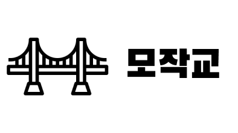
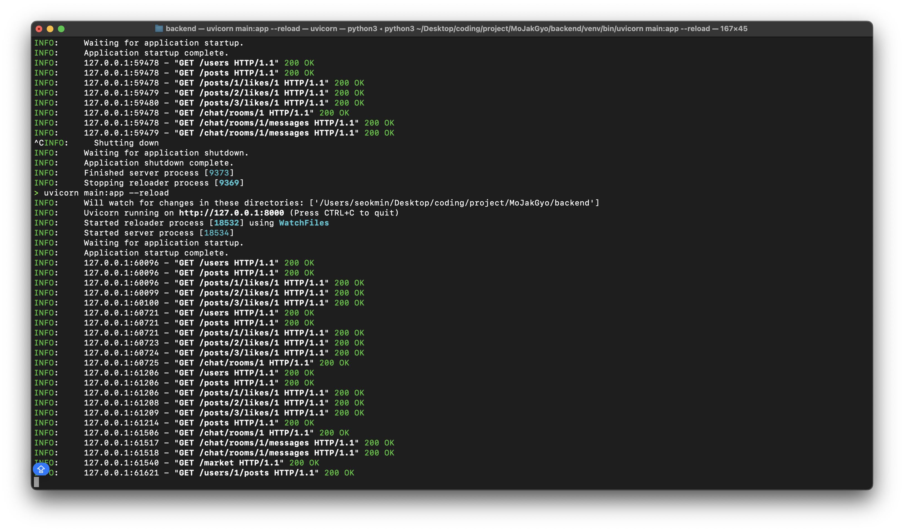

<h1 align="center">
    
</h1>

<h1 align="center" style="border-bottom: 0;">
모작교 - 모델과 작가를 이어주다
</h1>

<h4 align="center">
    <a href="https://opensource.org/license/gpl-3-0">
        
    </a>
    <br>
    <a href="https://github.com/seokmin12/MoJakGyo">
        
    </a>
    <a>
        
    </a>
    <a>
        
    </a>
</h4>

## Introduction 📌
**모작교**는 사진작가와 모델을 이어주는 [C2C](https://en.wikipedia.org/wiki/Customer_to_customer) 커뮤니케이션 앱입니다. <br>
모델들은 스냅사진, 웨딩사진등 전문 사진작가가 필요한 사진 촬영에서 작가를 섭외할 수 있는 방법이 많지 않았습니다.
사진 작가들 또한 자신의 포트폴리오에 사용할 인물 사진의 모델을 섭외할 수 있는 방법이 많지 않았습니다. <br>
이러한 문제점을 인식해 사진 작가는 자신이 찍었었던 사진들을 업로드하여 모델의 취향에 맞는 작가를 섭외할 수 있도록하고 모델은 자신의 프로필 사진이나 얼굴 사진들을 업로드하여 작가들이 모델을 더욱 쉽게 섭외할 수 있도록 하였습니다.

## Getting Started 🚀
1. Install expo
```
npm install expo
```
2. Run react app
```
npm start
```

## ScreenShot 📸


